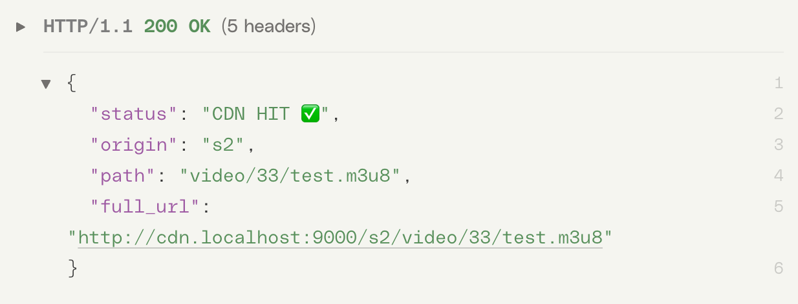

# 🎬 Сервис-балансировщик видео-трафика

Проект представляет собой простой FastAPI-сервис, который выполняет роль балансировщика видео-трафика. 
Он перенаправляет пользователей на CDN-сервер или оригинальный сервер в зависимости от определённых правил, используя HTTP 301 редирект.

---

## 🚀 Быстрый старт

Убедитесь, что у вас установлен Docker и Docker Compose.

### 📦 Запуск всех сервисов через Docker Compose

```bash
docker-compose up --build
```

Основной сервер будет доступен по адресу: **http://localhost:8000**

#### Перейти на http://localhost:8000/?video=http://s3.origin-cluster/video/9999/test123.m3u8 и получить



CDN-сервер: **http://localhost:9000**

## 🧪 Ручной запуск для разработки
### ✅ Запуск основного сервера вручную
```bash
uvicorn app.main:app --reload
```

### Пример запроса:

```bash
http://localhost:8000/?video=http://s3.origin-cluster/video/9999/test123.m3u8
```

### ✅ Запуск CDN-сервера вручную
```bash
uvicorn cdn.main:app --host 0.0.0.0 --port 9000
```

### 🔧 Зависимости
#### Управление зависимостями осуществляется через Poetry.

1. Установка Poetry:
```bash
pip install poetry
```

2. Установка зависимостей:

```bash
poetry install
```

### 🧰 Команды Docker (для справки)
1. Собрать проект: docker-compose build

2. Перезапустить: docker-compose up --build

3. Остановить: docker-compose down

## 👤 Автор - G. Lavrov